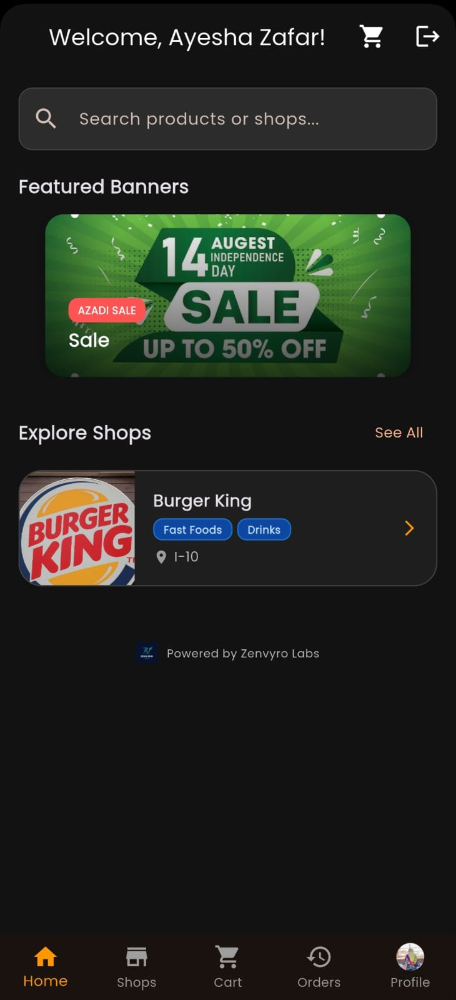
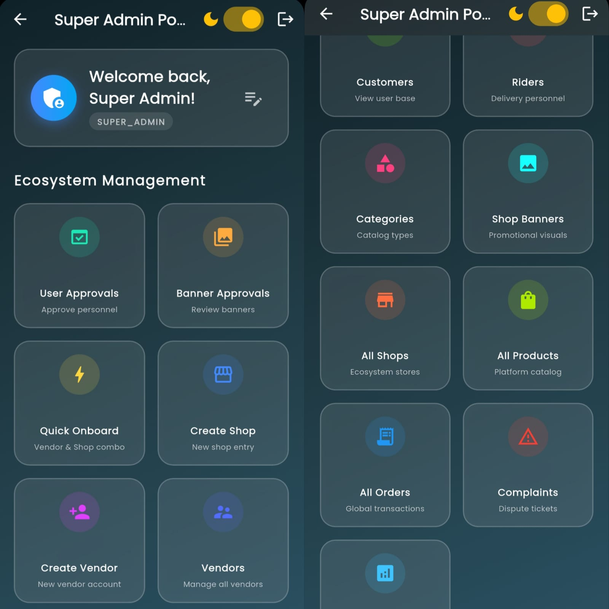
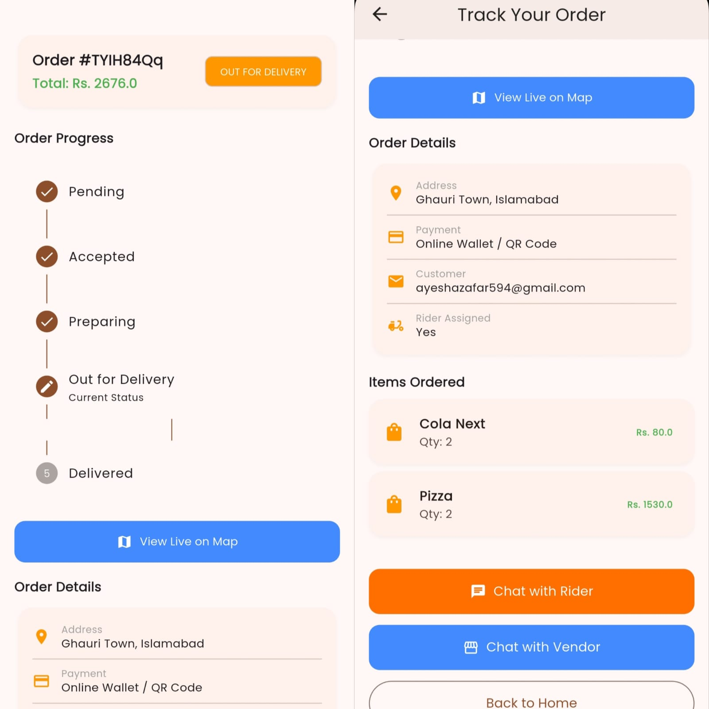
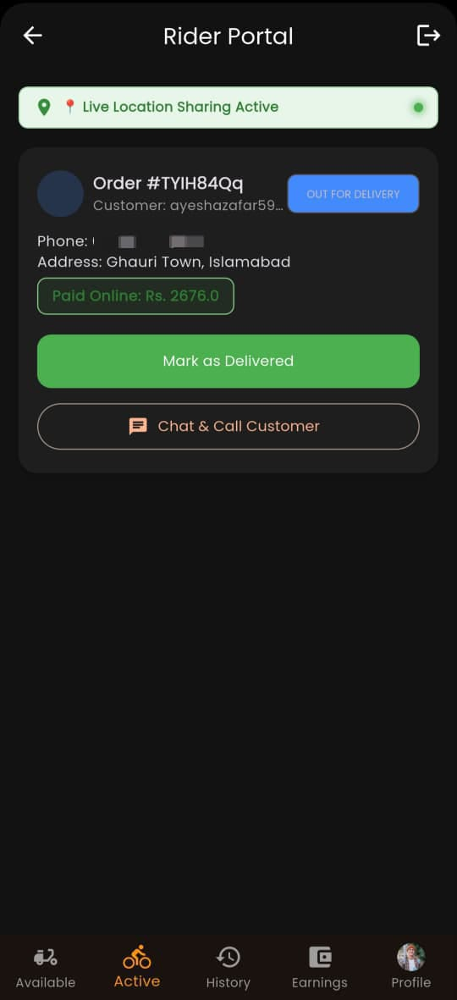
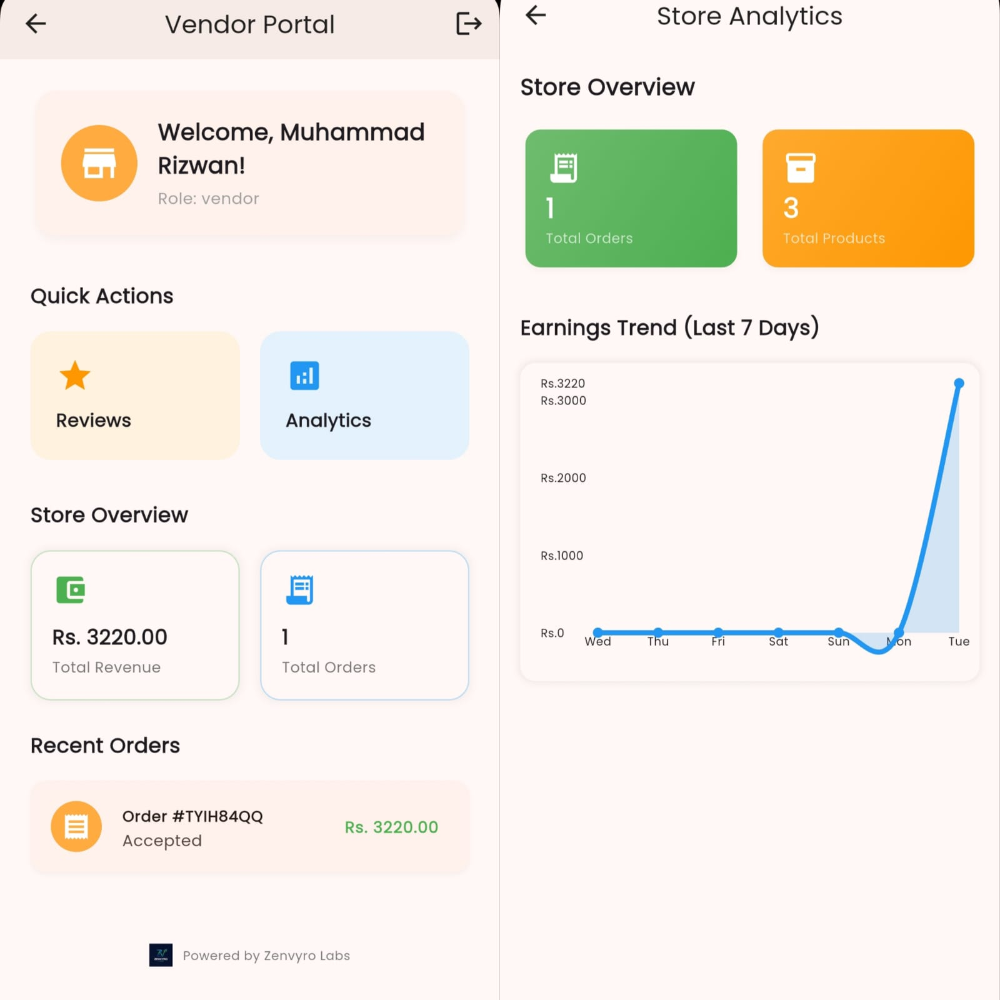
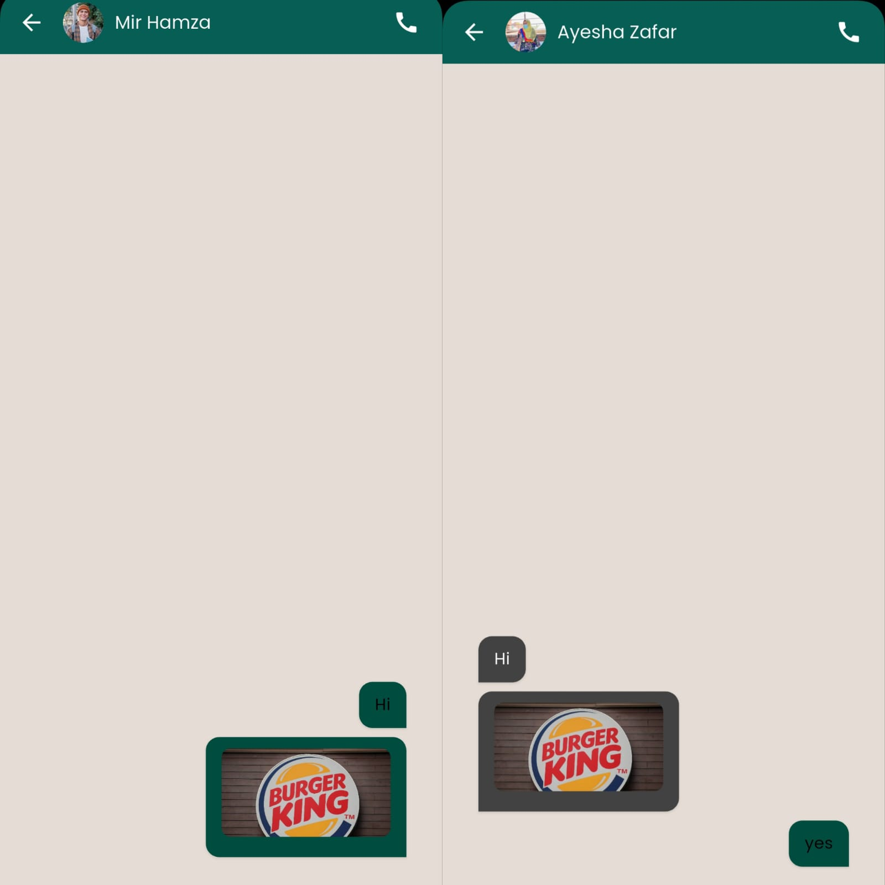

# All In One Mart - Multi-Vendor E-Commerce Ecosystem

  

**All In One Mart** is a cutting-edge, complete Multi-Vendor E-Commerce Ecosystem mirroring modern platforms like Foodpanda, Amazon, and Daraz. It features four distinct user roles—**Super Admin**, **Vendor**, **Customer**, and **Rider**—all operating smoothly within a single Flutter application seamlessly integrated with Firebase backend services.

The platform relies on real-time data synchronization utilizing Firebase Cloud Firestore and Firebase Cloud Storage, ensuring that state changes (like inventory updates, order tracking, chat messages, and rider availability) instantly propagate across all relevant users' devices.

---

## 📸 Application Gallery

### Multi-Role Dashboards

  
  &nbsp;&nbsp;&nbsp;&nbsp;
  

### Order Tracking & Logistics

  
  &nbsp;&nbsp;&nbsp;&nbsp;
  

### Analytics & Real-Time Chat

  
  &nbsp;&nbsp;&nbsp;&nbsp;
  

---

## 🔥 Key Features & Roles

### 👑 Super Admin
- Full system oversight and control through a beautiful Glassmorphism dashboard.
- Create Vendor accounts, provision Shops, and assign them to Vendors.
- Manage Customers, Riders, Categories, and Platform Banners.
- Approve or reject Vendor creation requests.

### 🏪 Vendor
- Assigned to a predefined Shop by the Super Admin.
- Dedicated Dashboard to monitor Shop performance and manage Sales using dynamic Revenue Charts.
- Dynamic control over Inventory (Categories and Products), handling pricing and stock limitations.
- Process Customer Orders by accepting, preparing, and marking them as "Ready for Pickup".

### 🛒 Customer
- Elegant interface to browse various Vendors and their Products.
- Add items to a smart Shopping Cart.
- Checkout flow offering multiple payment methods (including Cash on Delivery & Online QR Code Wallet).
- Fully functional order history and Real-time Tracking (Pending ➔ Accepted ➔ Preparing ➔ Out for Delivery ➔ Delivered).
- Interactive Live Map tracking for their active deliveries.

### 🏍 Rider
- Efficient interface for browsing available orders marked as "Ready for Pickup".
- Accept delivery assignments, view route/address details, and monitor their delivery history/earnings.
- Dynamic "Swipe to Deliver" mechanisms and distinctly color-coded payment warnings (COD vs Online Paid).
- WhatsApp-style Live Chat system for real-time contact with Customers.

---

## 🛠 Tech Stack & Packages

- **Frontend:** Flutter (Dart) using Riverpod for State Management.
- **Backend:** Firebase Authentication, Cloud Firestore (Real-time NoSQL), Firebase Storage (Media).
- **Design System:** Custom Dark/Light theme switching, Google Fonts, and Glassmorphism effects.
- **Key Integrations:** 
  - `fl_chart` for dynamic business analytics.
  - `google_maps_flutter` for real-time location mapping.
  - `cached_network_image` for optimized media loading.
  - `image_picker` for in-app media sharing in live chats and product uploads.

---

## 🚀 Setup Instructions

### 1. Prerequisites
- [Flutter SDK](https://flutter.dev/docs/get-started/install) (latest stable release).
- A valid Google Account to create a Firebase Project.

### 2. Implementation Steps
1. **Clone the Repository**: Pull the repository into a local working directory.
2. **Retrieve Dependencies**: Open your terminal locally at the project root and enter `flutter pub get`.
3. **Connect to Firebase**:
   - Run `flutterfire configure` to connect your own Firebase project.
   - Ensure the associated Firebase Console Project has **Authentication (Email/Password)**, **Firestore**, and **Storage** fully activated.
4. **Compile & Run**: Launch an iOS simulator or Android emulator and run `flutter run`.

--- 
*Note: The **Zenvyro Labs** branding logo has been integrated properly within the main Dashboard Footers reflecting corporate adherence.*

## 🔒 Evaluation & Testing
> **Reviewers:** To securely evaluate the Multi-Vendor ecosystem, the Super Admin and Vendor test credentials have been omitted from this public repository. Please refer directly to the **Submission Notes** in your evaluation portal for the secure login credentials.
