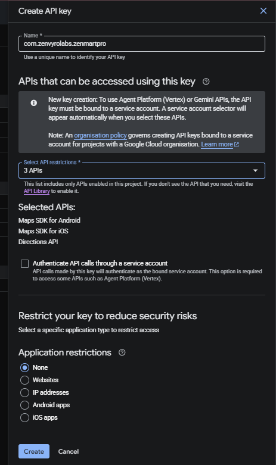

# 🧪 Zen Mart Pro - Final Testing Checklist

## 👑 1. Super Admin In-Depth Verification
*The Super Admin is the core of the ecosystem. This role must be tested thoroughly before Vendors or Customers interact with the platform.*
- [ ] Log in as a Super Admin (`admin@zenvyrolabs.com`).
- [ ] Verify the **glassmorphism UI** loads correctly in both Light and Dark modes.
- [ ] Check if the **ZenvyroLabs branding widget** is prominently visible on the dashboard.
- [ ] **Manage Categories:** Add a new global category (e.g., "Electronics") with an image and wait for it to successfully upload. Ensure it appears in the list.
- [ ] **Manage Users (Vendors):** 
    - [ ] Create a new Vendor account. 
    - [ ] Ensure you receive the local "New Vendor Registered" push notification.
    - [ ] Temporarily toggle a vendor's "Approve/Reject" flag to verify status changes push to Firebase.
- [ ] **Manage Users (Customers & Riders):** 
    - [ ] Navigate to both the Manage Customers and Manage Riders tabs. 
    - [ ] Try creating dummy accounts or just verify the real-time Firebase listener populates the tables correctly.
- [ ] **Manage Shops:** 
    - [ ] Create a new shop. 
    - [ ] Upload a banner image. 
    - [ ] Under the assignment dropdown, assign it specifically to the new Vendor you created.
- [ ] **Manage Banners (Approvals):** 
    - [ ] Look at the global banner list.
    - [ ] When a vendor uploads a custom shop banner to their shop, return here as the Admin to "Approve" or "Reject" the banner to ensure the workflow loop is solid.
- [ ] **Handle Complaints:**
    - [ ] Navigate to the Handle Complaints section.
    - [ ] Verify if any dummy complaints are visible, or leave this tab open until a Customer submits a complaint in Phase 3.
- [ ] **Reports & Analytics:** 
    - [ ] Verify that the dynamically generated Revenue Charts and User Registration metrics load.
    - [ ] Ensure that financial amounts shown are explicitly formatted in **Rs.** instead of standard dollars.
## 🏪 Vendor Operations
- [ ] Log in using the newly created Vendor credentials.
- [ ] Verify the **Vendor Dashboard** statistics load without errors.
- [ ] Navigate to **Upload Shop Banner**. Upload a banner and set a promotional event tag (e.g., "Summer Sale"). Note that it stays in a "Pending" state until approved by the Admin.
- [ ] Navigate to **Manage Products**. 
- [ ] **Test Discounts:** Add a product with an "Original Price" of `1000` and a "Discount Percentage" of `20`. Save the product. It should automatically calculate the final price as `800`.
- [ ] Ensure product images upload successfully without throwing a Firebase Storage object error.

## 🛒 Customer Experience
- [ ] Register as a new Customer (ensure OTP mock verification works).
- [ ] Ensure **dark mode readability** is flawless across the Customer Home and Shop displays.
- [ ] Verify the **Customer Home Screen** displays Shop tiles (and any promotional banner tags like "Summer Sale").
- [ ] View the Vendor's shop. Ensure the **Premium UI Product Cards** show up.
- [ ] Verify the newly added product displays a **glowing red "-20% discount" pill** and strikes out the `1,000` original price.
- [ ] Click the product heart to add it to the **Wishlist**. Open the Wishlist screen to verify it appears.
- [ ] Add the product to the **Cart**. 
- [ ] In the Shopping Cart, observe the **Delivery Information Banner** at the top.
- [ ] Proceed to **Checkout** using "Cash on Delivery", selecting an address. Note the Order ID on the confirmation screen.
- [ ] Verify **FCM Notifications**: You should receive a "New Order Placed" notification mock logic in the background (if tested on a physical device).
- [ ] Test the **Chat** or **Voice Call** deep-links from the order history to ensure the Android 11 dialer fix works.

## 🚚 Order Lifecycle & Rider Sync, 
- [ ] **Vendor:** Log back into the Vendor account. Go to **Active Orders**, select the Customer's order, and change the status from `PENDING` -> `PREPARING` -> `READY_FOR_PICKUP`.
- [ ] **Customer:** Check your active orders stream. The status should instantly update to `READY_FOR_PICKUP` on your screen.
- [ ] **Rider:** Log in as a Rider. 
- [ ] Verify the **Earnings Info Banner** displaying "You earn 100% of the delivery charge" is visible.
- [ ] Find the order in **Available Deliveries** and accept it. Update the status to `OUT_FOR_DELIVERY`.
- [ ] **Customer:** Check your screen to see the status change, and track the rider’s connection status.
- [ ] **Rider:** Mark the order as `DELIVERED`. Verify that your Earnings Dashboard balance increases by the exact amount of the delivery fee for that shop.

## ✨ Bonus Functionalities
- [ ] Ensure **QR Payments** generate a code successfully on the checkout screen when selected.
- [ ] Enter a **Coupon Code** at checkout (e.g., `WELCOME10`) to confirm the cart total deducts properly.
- [ ] Test the application without an internet connection momentarily to verify **Firestore offline caching** allows you to read previously loaded products.
